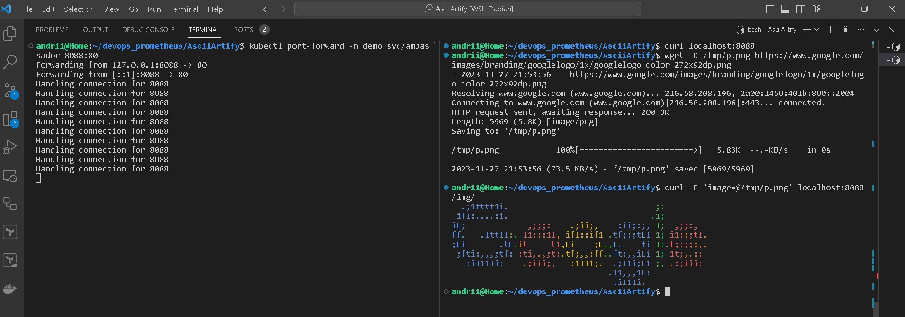

За допомогою графічного інтерфейсу ArgoCD створимо новий додаток:

Втсановити тип джерела (за замовчанням Git), а також вказати шлях до каталогу маніфестів:

Натистнути `CREATE` для створення додатку

Необхідно синхронізувати ArgoCD, необхідно виконати наступні дії:
- натиснути кнопку `SYNC`, оберемо конпоненти та режим синхронізації,

- натиснути `SYNCHRONIZE`

Розпочнеться процес зборки додатку

Стан додатку після завершення установки та запуску додатку


Запсук додатку Ambassador у створенному кластері:
Налаштування порт-форвард у ля доступу до додатку ззовні
```bash
kubectl port-forward -n demo svc/ambassador 8088:80
```
В іншому терміналі перевіряємо за допомогою програми `curl`, чи додаток відповідає:
```bash
curl localhost:8088
```
У випадку вдалого запсуку, отримаємо відповідь із версією додатку
Завантажимо зразок файлу за допомогою команди `wget`.
```bash
wget -O /tmp/p.png https://www.google.com/images/branding/googlelogo/1x/googlelogo_color_272x92dp.png
```
Завантажимо зразок для пеервірки роботи додатку за допомогою команди `curl`. 

```bash
curl -F 'image=@/tmp/p.png' localhost:8088/img/
```
Отримаємо результат у вигляді картинки з ASCII символів, що свідчить про коректну роботу додатку


### Висновок
ArgoCD — це популярний інструмент із відкритим вихідним кодом для керування та розгортання додатків у Kubernetes. Він надає зручний веб-інтерфейс для керування всім життєвим циклом розгортання додатків, від визначення бажаного стану до відстеження та відкату змін. ArgoCD пропонує такі функції, як автоматична синхронізація з репозиторієм Git, розбіжність і синхронізація додатків, відкат додатків і можливість керувати декількома кластерами. Завдяки простоті використання та потужній функціональності ArgoCD є цінним інструментом для керування складними розгортаннями Kubernetes і широко використовується в корпоративних середовищах.
