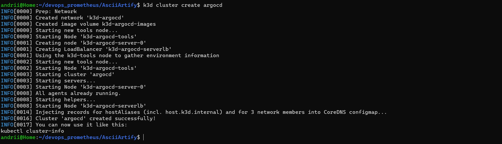
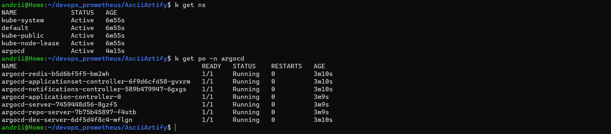

# Встановлення ArgoCD з графічним інтерфесом в k3d кластері 

## Короткий опис ArgoCD
ArgoCD це популярний інструмент безперервної доставки з відкритим кодом для Kubernetes, який автоматизовує розгортання програм, відстежує їх стан. Він надає як графічний веб-інтерфейс користувача, так і CLI для керування та розгортання програм у кількох кластерах і середовищах.  Реалізує підхід GitOps, використовуючи репозиторій Git як джерело для визначення бажаного стану програми

## Встановлення ArgoCD

Створити за допомогою k3d кластер з іменем argocd
```bash
k3d cluster create argocd
```


Для початку інсталяції ArgoCD створемо namespace argocd, в якому, за замовчанням, він буде встановлено. 

```bash
kubectl create namespace argocd
```

Запустити маніфест, що вміщує в себе всі необхідні сервіси та конфігурації для встановлення ArgoCD:
```bash
kubectl apply -n argocd -f https://raw.githubusercontent.com/argoproj/argo-cd/stable/manifests/install.yaml
```

Перевірити створення namespace та ресурсів ArgoCD
```bash
kubectl get ns
kubectl get all -A -n argocd
kubectl get pods -n argocd
```


Для доступу до ArgoCD використовуємо port-forward
```bash
kubectl port-forward svc/argocd-server -n argocd 8080:443&
```
Графічний інтерфейс ArgoCD буде доступний на локальній машині за адресою https://localhost:8080 

Для отримання паролю потрібно використати наступну команду:
```bash
kubectl -n argocd get secret argocd-initial-admin-secret -o jsonpath="{.data.password}" | base64 -d; echo
qiOgm9Mm0Dj18pYu
```


Використовуючи вказаний пароль та логін `admin` ми зайдемо в систему.


- Після входу ви перейдете на інформаційну панель ArgoCD, яка містить огляд усіх додатків, якими керує ArgoCD.


- Список додатків відображатиме всі додатки, якими керує ArgoCD, разом із їхнім поточним статусом. Щоб переглянути деталі конкретного додатку, натисніть на його назву у списку.

- У додатку ви можете переглядати деталі її поточного розгортання, включаючи репозиторій Git, з якого вона отримана, цільове середовище та будь-які поточні перевірки синхронізації чи працездатності.

- На сторінці відомостей про додаток ви можете виконувати різні дії, зокрема розгортати додаток в новому середовищі, синхронізувати його конфігурацію зі сховищем Git і просувати певну версію до робочої.


